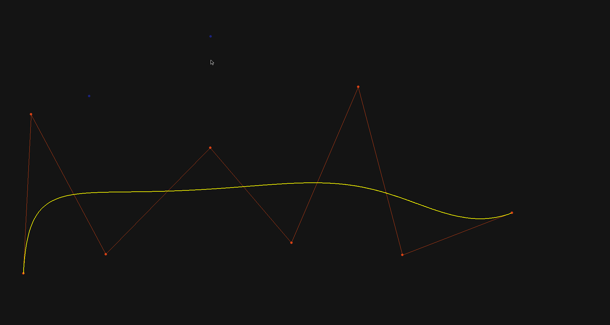
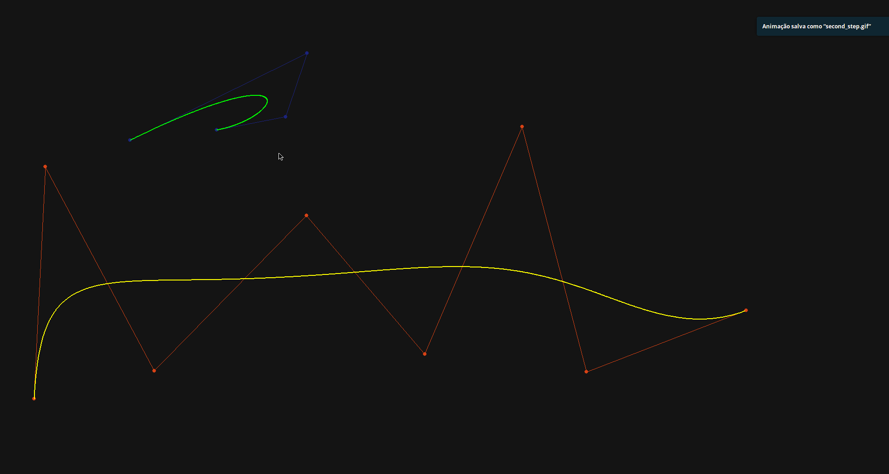

# [WIP] Geometric Modeling

## Requiries

First install some libs "(>_<)"

### Ubuntu/Linux

- install pygame

```sh
sudo apt install python-pygame
```

- install pip

```sh
sudo apt install python-pip
```

- install scipy

```sh
pip install scipy
```

- install numpy

```sh
pip install numpy
```

- isntall tkinter

```sh
sudo apt install python-tk
```

## RUN

To run the program you only have to white

`python main.py`

Click on some places to define the control points of the first and press the space key

like this:


Click on some places to define the control points of the second and press the space key

like this:



So press the space key to do `c0`

like this:


